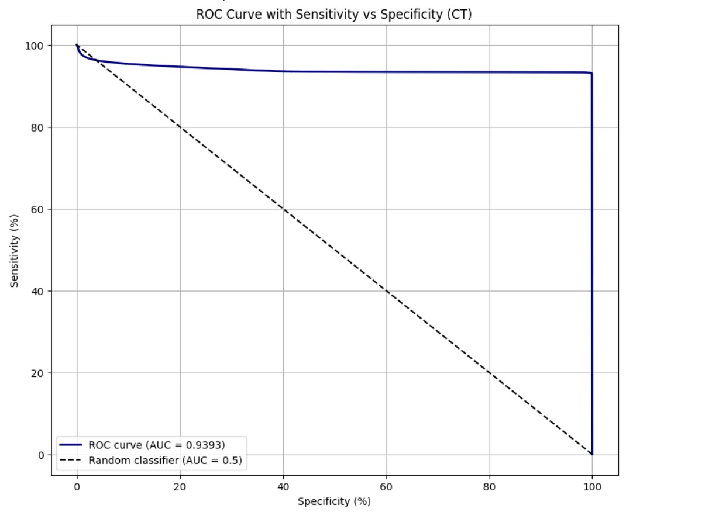
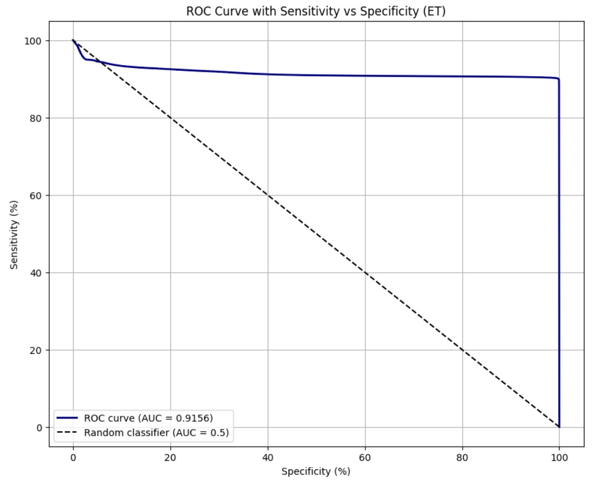

# **Brain Tumor Segmentation Using Improved ResUNet++ Architecture**

> 🚀 **A powerful deep learning model for precise brain tumor segmentation in MRI scans using an enhanced ResUNet++ architecture, outperforming 3D models with a lightweight 2D approach.**

---

This project introduces an improved **ResUNet++ architecture** for **brain tumor segmentation** from multimodal MRI scans. The task is decomposed into **three binary 2D segmentation problems**—Whole Tumor (WT), Tumor Core (TC), and Enhancing Tumor (ET)—enabling high precision with reduced computational overhead. The architecture integrates **residual blocks**, **Squeeze-and-Excite modules**, **attention mechanisms**, and **Atrous Spatial Pyramid Pooling (ASPP)** to effectively capture multi-scale contextual information. Trained on the **BraTS 2020** dataset, the model achieves impressive **Dice Scores**: **0.9492 (WT)**, **0.9299 (TC)**, and **0.8895 (ET)**, outperforming many existing 3D models in both segmentation accuracy and robustness.
## 📚 Dataset

This project utilizes the **BraTS 2020 (Brain Tumor Segmentation Challenge)** dataset, a gold standard for evaluating brain tumor segmentation algorithms in multimodal MRI scans. The dataset consists of pre-operative scans of glioblastoma and lower-grade glioma patients, with expert-annotated segmentation masks.

### 🔸 Dataset Details:
- **Total Training Cases:** 369
- **Image Dimensions:** 240 × 240 × 155 (Height × Width × Depth)
- **Pixel Value Range:** 0 – 255
- **Format:** NIfTI (.nii)

Each subject includes **five NIfTI files**:
- **Four MRI Modalities** (Channels):
  - 🧠 **T1** – Native T1-weighted
  - 💉 **T1CE** – Post-contrast T1-weighted with gadolinium enhancement
  - 🌊 **T2** – T2-weighted
  - 🧪 **FLAIR** – T2 Fluid Attenuated Inversion Recovery

- **One Segmentation Mask**, with pixel-wise labels:
  - `0` – Background
  - `1` – Necrotic and Non-Enhancing Tumor Core (NCR/NET)
  - `2` – Peritumoral Edema (ED)
  - `4` – GD-Enhancing Tumor (ET)

> ⚠️ Label `3` is not used (no pixels contain this label).

Each label contributes to the formation of three main binary segmentation tasks:
- **Whole Tumor (WT)** = Label 1 + 2 + 4
- **Tumor Core (TC)** = Label 1 + 4
- **Enhancing Tumor (ET)** = Label 4

> 📥 The dataset can be downloaded from the official BraTS 2020 challenge page:  
> [https://www.med.upenn.edu/cbica/brats2020/data.html](https://www.med.upenn.edu/cbica/brats2020/data.html)

## 🧪 Preprocessing

To reduce computational complexity, the original **3D MRI volumes** (240 × 240 × 155) from the BraTS 2020 dataset are converted into **2D slices**. Each subject contains 5 `.nii` files — 4 input channels and 1 ground truth segmentation mask. We excluded the **T1 (native)** modality due to its limited tumor contrast, retaining **T1CE, T2, and FLAIR** modalities.

  

<b>Showing a random slice of T1CE, T2, T2-FLAIR & mask</b>

### 🔹 Input Preprocessing:
- Extracted **10 representative 2D slices** per subject by fixing the slice index and iterating across the remaining dimensions.
- Each slice was resized to **128 × 128** pixels.
- **Normalization** was applied to each modality:  
  `Normalized = (pixel - mean) / std`
- Finally, the three channels (**T1CE, T2, FLAIR**) were **stacked** to form a single multi-channel 2D input.

### 🔹 Mask Preprocessing:
- Ground truth masks consist of:
  - `1` → Necrotic/Non-enhancing Tumor Core (NCR/NET)
  - `2` → Peritumoral Edema (ED)
  - `4` → Enhancing Tumor (ET)
  - `0` → Background
  - `3` → Not used (no pixels contain label 3)
- For **binary segmentation**, all non-zero labels were converted to `1` (tumor), preserving `0` for the background.
- Masks were reshaped to **2D slices (128 × 128)** in alignment with the image slices.

After preprocessing, we structured the dataset into three **binary segmentation tasks** — each targeting a specific tumor region: **Whole Tumor (WT)**, **Tumor Core (TC)**, and **Enhancing Tumor (ET)**. This separation improves model focus and precision for each class. Below are the pre-processed images for each segmentation task:

  

<b>Pre-processed images For WT</b>

  

<b>Pre-processed images For TC</b>

  

<b>Pre-processed images for ET</b>

## 🧠 Proposed Architecture

We have used an **improved version of ResUNet++ architecture** to train our model.  
ResUNet++ is a deep learning architecture specifically designed for biomedical image segmentation tasks like **brain tumor segmentation**. It builds upon the standard U-Net by incorporating:

- ✅ Residual Blocks  
- ✅ Squeeze and Excite Blocks  
- ✅ Atrous Spatial Pyramid Pooling (ASPP)  
- ✅ Attention Mechanisms  

These components help the model to learn more complex patterns and focus on important features, making it more **efficient and accurate** than the basic ResUNet.

  

<b>Fig 5: Improved ResUNet++ Architecture</b>

---

### 🔁 Encoder

The input image (3-channel 2D image of size **128×128×3**) is processed through the following steps:

1. **Stem Block**
2. **Squeeze and Excite Block**
3. Repeated **3 times**:  
   - Residual Block  
   - Squeeze and Excite Block

This pattern extracts and refines features at multiple levels. After each residual block:
- 🟢 **Spatial dimensions are halved** (→ 64, 32, 16)
- 🟢 **Channels are doubled** (→ 32, 64, 128)

---

### 🌉 Bridge (ASPP Block)

The encoder output is passed to an **ASPP (Atrous Spatial Pyramid Pooling)** block. This:
- Enlarges the receptive field
- Captures **multi-scale context**
- Output size: **16×16×256**

---

### 🔁 Decoder

The decoder reconstructs the segmentation map using:

- Attention Block  
- Upsampling  
- Concatenation with encoder features  
- Residual Block  
- Squeeze and Excite Block

This is repeated **3 times**, increasing spatial resolution: **(16 → 32 → 64 → 128)**.  
Finally:
- Another **ASPP block** is applied
- Followed by **1×1 convolution** (1 filter)
- Result: **128×128×1 segmentation map**
- A **sigmoid activation** ensures output values between **0 and 1**

---

## 🧩 Different Blocks Used in the Architecture

### 🔷 Stem Block

  

<b>Stem Block</b>

- First 2 convolutions: `3×3`, 32 filters, stride = 1
- Batch Normalization + ReLU
- A skip connection via `1×1 convolution`
- Output = sum of convolution path and skip path  
  ➕ Helps capture features **more precisely**

---

### 🔷 Squeeze and Excite (SE) Block

  

<b>Squeeze and Excite Block</b>

- Uses **Global Average Pooling** for "squeeze"
- Followed by 2 dense layers to "excite"
- Learns **channel-wise relationships**
- Applies learned weights to recalibrate channels via multiplication

---

### 🔷 Residual Block

  

<b>Residual Block</b>

- 4 stacked layers: BatchNorm → ReLU → Conv
- Identity skip connection via `1x1 convolution`
- Helps with:
  - ⚡ Faster training
  - 💡 Better gradient flow
  - 🧠 Efficient learning

---

### 🔷 ASPP Block (Atrous Spatial Pyramid Pooling)

  

<b>ASPP Block</b>

- Extracts multi-scale features using:
  - 3 dilated convolutions with rates: 6, 12, 18
  - 1 regular convolution
- Outputs are merged and passed through a `1×1 convolution`
- Captures both **local** and **global** contexts  

---

### 🔷 Attention Block

  

<b>Attention Block</b>

- Takes input from:
  - Decoder (feature info)
  - Encoder (spatial info)
- Applies:
  - BatchNorm → ReLU → Conv → MaxPooling (encoder side)
  - BatchNorm → ReLU → Conv (decoder side)
- Outputs are combined and enhanced  
- Focuses model attention on **relevant regions**

---
## 🔧 Training and Evaluation

We have trained our model using an **improved version of the ResUNet++ architecture**, as described in the previous section. This architecture is particularly suited for biomedical image segmentation tasks due to its enhanced feature extraction and efficient learning capabilities.

### 📊 Dataset Splitting  
We utilized **75% of the dataset for training** and the remaining **25% for evaluation**. The dataset included **2767 images** for each of the following MRI modalities and their corresponding masks:
- **T1CE**
- **T2**
- **T2 FLAIR**
- **Ground Truth Mask**

### ⚙️ Training Configuration
- **Optimizer**: Nadam (Nesterov-accelerated Adaptive Moment Estimation)  
- **Loss Function**: Binary Dice Loss (suitable for binary segmentation tasks)  
- **Batch Size**: 16  
- **Epochs Trained**:
  - **Whole Tumor (WT)**: 60 epochs
  - **Tumor Core (TC)**: 50 epochs
  - **Enhancing Tumor (ET)**: 69 epochs

Training was halted at these points due to:
- **Onset of Overfitting**
- **Rising Computational Complexity**

### 📈 Evaluation Metrics
To comprehensively evaluate the model’s performance, we employed the following metrics:
- **Dice Score**
- **Mean Intersection over Union (IoU)**
- **IoU Score**
- **F1 Score**
- **Recall**
- **Precision**
- **Sensitivity**
- **Specificity**

The table below summarizes the results of model evaluation across the three tumor subregions:

| Tumor Subregion     | Loss   | Dice Score | IOU Score | Mean IOU | F1 Score | Recall | Precision | Sensitivity | Specificity |
|---------------------|--------|------------|-----------|-----------|----------|--------|------------|--------------|-------------|
| Whole Tumor (WT)    | 0.0508 | 0.9492     | 0.9035    | 0.9507    | 0.9492   | 0.9509 | 0.9501     | 0.9494       | 0.9987      |
| Tumor Core (TC)     | 0.0699 | 0.9299     | 0.8693    | 0.9421    | 0.9298   | 0.9352 | 0.9465     | 0.9137       | 0.9994      |
| Enhancing Tumor (ET)| 0.0951 | 0.9050     | 0.8273    | 0.9128    | 0.9050   | 0.9113 | 0.9064     | 0.9083       | 0.9995      |

## 🧪 Prediction and Evaluation

After training the model, we performed predictions on the test dataset for all three tumor subregions — Whole Tumor (WT), Tumor Core (TC), and Enhancing Tumor (ET). The results show high accuracy and consistency with the ground truth, both visually and quantitatively.

---

### 📊 Confusion Matrix

  

<b>Confusion Matrix showing classification performance.</b>

---

### 🧠 Predicted Segmentation Maps

The model was tested on different tumor regions using the improved ResUNet++ architecture. Below are the predicted segmentation maps visualized for each tumor subregion.

  

<b>Predicted segmentation map for Whole Tumor (WT).</b>

  

<b>Predicted segmentation map for Tumor Core (TC).</b>

  

<b>Predicted segmentation map for Enhancing Tumor (ET).</b>

---

### 📈 ROC Curves

The ROC (Receiver Operating Characteristic) curves for each tumor subregion are shown below. These curves help evaluate the performance of the classification model by comparing true positive rates against false positive rates.

  

<b>ROC Curve for Whole Tumor (WT).</b>

  

<b>ROC Curve for Tumor Core (TC).</b>

  

<b>ROC Curve for Enhancing Tumor (ET).</b>

